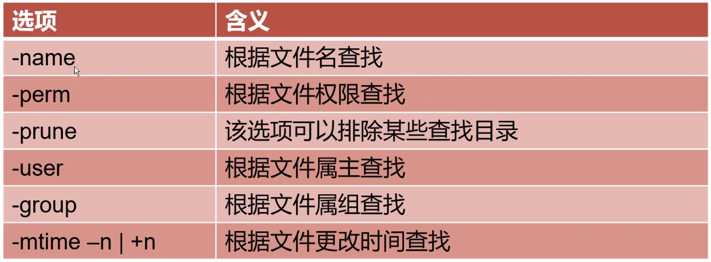
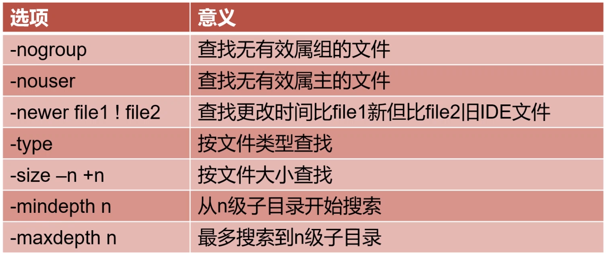
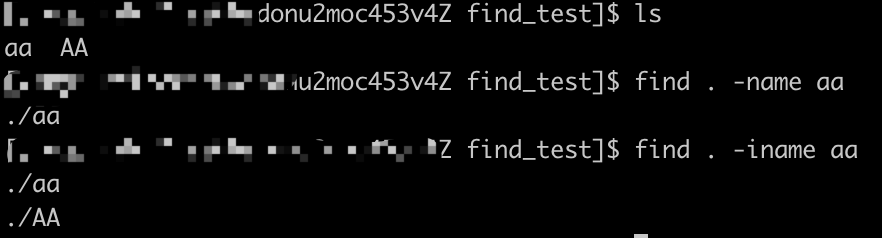

# Linux

[TOC]

## 命令

#### sudo

sudo : 暂时切换到超级用户模式以执行超级用户权限，提示输入密码时该密码为当前用户的密码，而不是超级账户的密码。不过有时间限制，Ubuntu默认为一次时长15分钟。
su ： 切换到某某用户模式，提示输入密码时该密码为切换后账户的密码，用法为“su 账户名称”。如果后面不加账户时系统默认为root账户，密码也为超级账户的密码。没有时间限制。
sudo -i: 为了频繁的执行某些只有超级用户才能执行的权限，而不用每次输入密码，可以使用该命令。提示输入密码时该密码为当前账户的密码。没有时间限制。执行该命令后提示符变为“#”而不是“$”。想退回普通账户时可以执行“exit”或“logout” 。

### 查找类

#### find

>find [路径] [选项] [操作]

**选项参数对照表：**

　　****

　　 

**三、常用选项**

　　**-name**　　查找 /etc 目录下以 conf 结尾的文件，文件名区分大小写，例如：find /etc -name '*.conf'

　　**-iname**   查找当前目录下所有文件名为 aa 的文件，文件名不区分大小写，例如：find . -name aa

　　　　

　　**-user**　　查找文件所属用户为 yangyang 的所有文件，例如：find . -user yangyang

　　**-group**  查找文件所属组为 yangyang 的所有文件，例如：find . -group yangyang

　　**-type**　　根据类型查找：如下

　　　　　　**f**　　 文件　　　　　　　　find . -type f

　　　　　　**d**　　目录　　　　　　　　find . -type d

　　　　　　**c**　　字符设备文件　　　　find . -type c

　　　　　　**b**　　块设备文件　　　　　find . -type b

　　　　　　**l**　　 链接文件　　　　　　find . -type l

　　　　　　**p**　　管道文件　　　　　　find . -type p

 

　　**-size**　  根据文件大小查询

　　　　　　-n　　**小于** 大小为 **n** 的文件

　　　　　　+n　　**大于** 大小为 **n** 的文件

　　　　　　举例1：查找 /ect 目录下，小于 10000 字节的文件。 find /etc -size +10000c

　　　　　　举例2：查找 /etc 目录下，大于 1M 的文件。find /etc -size -1M

 

　　 **-mtime**　　

　　　　　　**-n**　　n 天以内修改的文件。

　　　　　　**+n**　　n 天以外修改的文件。

　　　　　　**n**　　 正好 n天 修改的文件

　　　　　　举例1: 查询 /etc 目录下，5天以内修改 且以 conf 结尾的文件。　find /etc -mtime -5 -name '*.conf'

　　　　　  举例2: 查询 /etc 目录下，10天之前修改，且属于 yangyang 的文件。　　find /etc -mtime +10 -user yangyang

 

　　**-mmin**　　

　　　　　　**-n**　　n 分钟以内修改过的文件

 　　　　 **+n**　　n 分钟之前修改过的文件

　　　　　　举例1: 查询 /etc 目录下 30分钟 之前修改过的文件。 　find /etc -mmin +30

 　　　　 举例1: 查询 /etc 目录下 30分钟 之前修改过的目录。 　find /etc -mmin -30 -type d

 

　　**-mindepth n**　　从第 n 级目录开始搜索

　　　　　　举例：从 /etc 的第三级子目录开始搜索。 find /etc -mindepth 3

 

　　**-maxdepth n**　　表示至多搜索到第 n-1 级子目录。

　　　　　　举例1: 在 /etc 中搜索符合条件的文件，但最多搜索到 2级 子目录。　　find /etc -maxdepth 3 -name '*.conf'

　　　　　　举例2: find /etc -type f -name '*.conf' -size +10k -maxdepthc 2

 

**四、不常用选项**

　　**-nouser**   查询没有所属用户的文件**
**

　　　　　　举例：find /etc -type f -nouser

　　**-nogroup**　查询没有所属组的文件**
**

　　　　　　举例：find /etc -type f -nogroup

　　**-perm**　　根据权限查询

　　　　　　举例：find /etc -perm 664

 

　　**-prune**　　通常和 -path 一起使用，用于将**特定目录**排除在搜索条件之外。过滤条件写在其他条件前面。

　　　　　　举例1：查找当前目录下的所有普通文件，但排除 test目录。

　　　　　　　　find . -path ./test -prune -o -type f

　　　　　　举例2: 查找当前目录下所有普通文件，但排除 test目录 和 opt目录。

　　　　　　　　find . -path ./test -prune -o -path ./opt -prune -o -type f 　

　　　　　　举例3: 查找当前目录下所有普通文件，但排除 test目录 和 opt目录，但属主为 yangyang

　　　　　　　　find . -path ./test -prune -o -path ./opt -prune -o -type f -a -user yangyang

　　　　　　举例4: 查找当前目录下所有普通文件，但排除 test目录 和 opt目录，但属主为 yangyang，且文件大小必须大于 500字节

　　　　　　　　find . -path ./test -prune -o -path ./opt -prune -o -tyep f -a -user yangyang -a -size +500

 

　　**-newer file1** 

　　　　　　举例：查找当前目录下比 a 文件要新的文件。 find . -newer a 

**五、操作查找到的文件**　

　　**-print**　　打印输出。 默认的选项，即打印出找到的结果。

　　**-exec**　　对搜索到的文件执行特定的操作，**固定的**格式为：-exec 'commond' {} \;  **注意：{} 表示查询的结果。**

　　　　　　举例1: 搜索 /etc 目录下的文件（非目录），文件以 conf 结尾，且大于 10k，然后将其删除。

　　　　　　　　find /etc -type f -name '*.conf' -size +10k -exec rm -f {} \;

　　　　　　举例2: 将 /data/log/ 目录下以 .log 结尾的文件，且更改时间在 7 天以上的删除。

　　　　　　　　find /data/log -name '*.log' -mtime +7 -exec rm -f \;

　　　　　　举例3: 搜索条件同 例1 一样，但是不删除，只是将其复制到 /root/conf 目录下

　　　　　　　　find /etc -type f -name '*.conf' -size +10k -exec cp {} /root/conf/ \;

　　**-ok**　　和 **-exec** 的功能一样，只是**每次操作**都会给用户提示。　　

**六、逻辑运算符**　

　　**-a　　　　与** （默认情况查询条件之间都是 与 的关系）

　　**-o　　　　或**

　　**-not | ！　 非** 