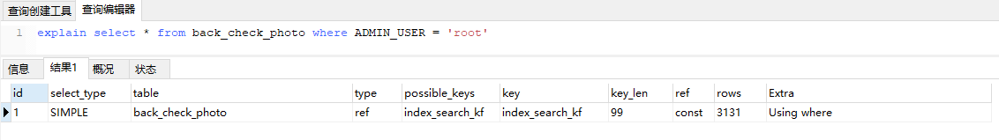

# DB

[TOC]

## 基础内容

### 范式

#### 第一范式

> 表中的每一列都是不可分割的数据项。
>
> 简单概况就是无重复的列。比如说员工姓名、电话（包括了手机和座机）组成的表，依据第一范式需要将电话分为移动电话和固定电话两个属性。

#### 第二范式

>学号、课程号、学分、成绩表，学分跟学号弱关联，容易造成数据冗余，拆分为学号，课程号，分数和课程号，学分两个表

#### 第三范式

>

### 存储过程

> 预编译一批sql，创建一次后下次直接调用，可以动态传条件参数

#### 优点

>重复使用：存储过程可以重复使用，从而可以减少数据库开发人员的工作量。
>
>减少网络流量：存储过程位于服务器上，调用的时候只需要传递存储过程的名称以及参数就可以了，因此降低了网络传输的数据量。
>
>安全性：参数化的存储过程可以防止SQL注入式攻击，而且可以将Grant、Deny以及Revoke权限应用于存储过程

#### 缺点

> 更改比较繁琐

### 视图

> 多表关联查询结果形成的虚拟表，每次打开都重新执行

#### 优点

> 简化操作，不用重复写sql，直接查视图名
>
> 保证原表安全，虚拟表控制显示内容

#### 缺点

> 不支持数据修改？

### 主键

>如未设定会自动选表内唯一字段，如果没有唯一字段则采用全局公共的隐含主键

#### 建表时如果没有指定主键？

> 如果没有主动设置主键，会选一个不包含NULL的第一个唯一索引列作为主键列，建立一个聚合索引。
>
> 如果没有这样的索引就会使用行号生成一个聚集索引，把它当做主键，这个行号6bytes，自增。可以用select _rowid from table来查询。

### 查看服务器状态信息

>session：当前连接的统计结果
>
>global：上次启动至今的统计结果
>
>不写默认使用参数是“session”

```sql
show [session|global]status
```

### 事务的隔离级别

> 用来限定事务内外的哪些改变可见的，哪些改变不可见
>
> 低级别的隔离等级拥有更低的系统开销，支持更高的并发

```sql
show variables like 'tx_isolation';
```

| 类型                           | 说明                                                   | 产生问题                                                     | 备注                                      |
| ------------------------------ | ------------------------------------------------------ | ------------------------------------------------------------ | ----------------------------------------- |
| 读取未提交（read uncommitted） | 所有事务都可以看到其他未提交事务的执行结果             | 不加锁，因此可能出现脏读、不可重复读、幻读                   | 基本不用                                  |
| 读取已提交（read committed）   | 一个事务只能看见已经提交事务所做的改变                 | 不加锁，而使用版本链方式，所以不会产生脏读，可能出现不可重复读和幻读 | SQL Server和Oracle的默认隔离级别          |
| 可重复读（repeatable read）    | 同一事务的多个实例在并发读取数据时，会看到同样的数据行 | 读的时候禁止update，可能出现幻读                             | MySQL的默认隔离级别（间隙锁解决幻读问题） |
| 串行化（serializable）         | 强制事务排序，使之不可能相互冲突，从而解决幻读问题     | 在每个读的数据行上加上共享锁，可能导致大量的超时现象和锁竞争 | 很少用于实际应用                          |

| 名词       | 说明                                                         |
| ---------- | ------------------------------------------------------------ |
| 脏写       | 两个事务都修改同一条数据，都没提交，结果一个事务回滚了，把另一个事务修改的值也撤销了 |
| 脏读       | 事务B去查询事务A修改过的数据，但此时事务A还未提交，事务A可能会回滚导致事务B再次读数据发生变化 |
| 不可重复读 | 一个事务周期内多次读取某个数据，结果不一致（同一事务的其他实例在该实例处理其间可能会有新的commit，select可能返回不同结果） |
| 幻读       | 事务A读取某一范围的数据行时，事务B又在该范围内insert了新行，事务A再读取该范围的数据行时，会发现有新的“幻影” 行 |

### 索引

>满足特定查找算法的数据结构

#### 索引类型


| 索引类型                | 说明                             |                                                              | 备注                           |
| ----------------------- | -------------------------------- | ------------------------------------------------------------ | ------------------------------ |
| 主键索引（primary key） | 主键，列值唯一（值不可以有null） |                                                              |                                |
| 唯一索引（qnique）      | 值不可重复（值可以有null）       | 唯一索引：ALTER TABLE table_name ADD UNIQUE (column);唯一组合索引：ALTER TABLE table_name ADD UNIQUE (column1,column2); |                                |
| 普通索引（index）       | 无限制                           | ALTER TABLE table_name ADD INDEX index_name (column);        |                                |
| 组合索引                | 多个索引组合                     | ALTER TABLE table_name ADD INDEX index_name(column1,column2, column3); | 最左原则                       |
| 全文索引                |                                  | ALTER TABLE table_name ADD FULLTEXT (column);                | 对文本的内容进行分词，进行搜索 |

>查看索引：SHOW INDEX FROM table_name;
>
>索引一经创建不能修改，只能删除重建。DROP INDEX index_name ON table_name;


### 锁

#### 行级锁

>锁定一行，需要用到对应的索引

#### 表级锁

> 对整个表加锁

#### 间隙锁

>查询条件是一个范围，会锁定整个区间，即使某些不存在的键值也会被无辜的锁定，而造成在锁定的时候无法插入锁定键值范围内的任何数据
>
>可以防止幻读，以满足相关隔离级别的要求

#### 临建锁

>行锁+间隙锁，即临键锁是是一个左开右闭的区间，比如（3，5]

#### 共享锁（Shared Locks）

>一个事务并发**读取**某一行记录所需要持有的锁
>
>select ... lock in share mode

#### 排他锁（Exclusive Locks）

>一个事务并发**更新或删除**某一行记录所需要持有的锁
>
>select ... for update


#### 意向共享（IS）/意向排他锁（IX）？？？待确定


>意向共享锁/意向排他锁属于**表锁**，取得意向共享锁/意向排他锁是取得共享锁/排他锁的**前置条件**
>
>例子：事务A修改user表的记录，会先给user表上一把意向排他锁（IX），再给记录上一把行级的排他锁（X），这时事务B要给user表上一个排他锁就会被阻塞。意向锁通过这种方式实现了行锁和表锁共存且满足事务隔离性的要求。


#### 死锁

>当两个事务同时执行，一个锁住了主键索引，在等待其他相关索引。另一个锁定了非主键索引，在等待主键索引。这样就会发生死锁。
>
>发生死锁后，InnoDB一般都可以检测到，并使一个事务释放锁回退，另一个获取锁完成事务。
>
>有多种方法可以避免死锁，这里只介绍常见的三种
>
>　　1、如果不同程序会并发存取多个表，尽量约定以相同的顺序访问表，可以大大降低死锁机会。
>
>　　2、在同一个事务中，尽可能做到一次锁定所需要的所有资源，减少死锁产生概率；
>
>　　3、对于非常容易产生死锁的业务部分，可以尝试使用升级锁定颗粒度，通过表级锁定来减少死锁产生的概率；
>
>MyISAM中是不会产生死锁的，因为MyISAM总是一次性获得所需的全部锁，要么全部满足，要么全部等待。而在InnoDB中，锁是逐步获得的，就造成了死锁的可能。
>
>在MySQL中，行级锁并不是直接锁记录，而是锁索引。索引分为主键索引和非主键索引两种，如果一条sql语句操作了主键索引，MySQL就会锁定这条主键索引；如果一条语句操作了非主键索引，MySQL会先锁定该非主键索引，再锁定相关的主键索引。 在UPDATE、DELETE操作时，MySQL不仅锁定WHERE条件扫描过的所有索引记录，而且会锁定相邻的键值，即所谓的next-key locking。

## SQL查询效率优化

### 开启慢查日志，找出慢查sql

>

### 查看语句执行计划

>查看语句使用索引情况

```sql
explain select * from back_check_photo where ADMIN_USER = 'root'
```



#### 1、结果参数说明

##### select_type 

> 查询类型

simple简单查询  primary 主查询  UNION 第二个或者后面的查询语句。SUBQUERY : 子查询中的第一个select

##### table

> 结果输出表

##### type

> 查询级别

|              |                                        |                                                 |
| ------------ | -------------------------------------- | ----------------------------------------------- |
| ALL          | 全表扫描                               |                                                 |
| index        | 索引全扫描                             |                                                 |
| range        | 索引范围扫描                           |                                                 |
| ref          | 使用非唯一索引或唯一索引的前缀扫描     |                                                 |
| eq_ref       | 使用唯一索引                           |                                                 |
| const/system | 单表中最多有一个匹配行                 | 使用primary key或unique索引，因为数据都是唯一的 |
| NULL         | 不用访问表或者索引，直接就能够得到结果 |                                                 |

##### possible_keys

> 可能使用的索引列表

##### key

> 实际使用的索引

##### key_len

> 索引长度

##### ref

> 使用了哪列或常数

##### row

> 执行查询的行数，数值越大越不好，说明索引没有用好

### 索引优化

#### 1、字段的区分度非常低，值大部分都相同，没有必要在此列建立索引

>比如说性别0/1，索引无法用二分查找，没意义

#### 2、使用前缀索引

>当字符串比较长，前n个字符就不同，可以创建前缀索引
>
>前缀索引能够减小索引文件大小，提高索引查询速度。（order、group无法用到该索引）

```sql
ALTER TABLE table_name ADD index_name (column(n))
```

#### 3、联合索引

>遵循最左原则：要从索引左边第一个往后连续使用，但不要求全部使用

```sql
索引顺序：ADMIN_USER, CHECK_TIME, TASK_STATUS
以下能使用索引（查询条件会重排与索引顺序一致）：
select * from back_check_photo where ADMIN_USER = 'root' AND CHECK_TIME > 0  
select * from back_check_photo where CHECK_TIME > 0 AND TASK_STATUS = 1 AND ADMIN_USER = 'root'
以下使用部分索引（ADMIN_USER可以用到索引，TASK_STATUS用不到）：
select * from back_check_photo where ADMIN_USER = 'root' AND TASK_STATUS > 0 
以下不能使用索引：
select * from back_check_photo where TASK_STATUS > 0  
select * from back_check_photo where CHECK_TIME > 0 AND TASK_STATUS > 0  
```

#### 4、排序

> 排序可以利用复合索引，但是多个字段排序，要不都升序，要不都降序，不能混着来（复合索引是多个字段排升序）

#### 5、索引并不是越多越好

>索引不要建太多
>
>索引可以提高select效率，但是 insert 或 update 时有可能会维护索引，影响insert、update效率
>
>一般不超过5、6个

### 建表要注意的地方

#### 1、列的默认值不要为null

>值为null，可能出现不使用索引情况，可改为填充0

### SQL中要注意的地方

#### 1、不要使用*来查询

>用具体的字段代替*

#### 2、避免在where上使用负向条件，如not in、not exist、not like、!=等

>负向条件查询不能使用索引

#### 3、避免在where上使用<>、or等

查询时CPU消耗：or>in>union

>id<>3则可使用id>3 or id<3来代替
>
>or必须都是独立索引，如果某一个条件没有索引，那么涉及到的索引都不会被用到

```sql
select id from t where num in(1,2,3)	
对于连续的数值，能用 between 就不要用 in 
改为：	
select id from t where num between 1 and 3	
```

```sql
select id from t where num=10 or num=20
改为：	
select id from t where num=10	
union all	
select id from t where num=20	
```

#### 4、不要在=左侧字段上进行运算

>会在每行计算，导致索引失效

```sql
select * from users where YEAR(adddate)<2007;  
改为
select * from users where adddate<‘2007-01-01’;
```

#### 5、LIKE语句操作要注意

>前导模糊查询不能命中索引，%s、%s%
>
>非前导模糊查询可以命中，s%

用比较函数？instr(字段名,'字符串')>0

```sql
EXPLAIN SELECT * FROM user WHERE name LIKE '%s%';
改为
EXPLAIN SELECT * FROM user WHERE name LIKE 's%';
```

#### 6、避免出现隐式转换

>出现隐性转换不会使用索引
>
>查询字段为varchar时要注意，要将字符常量值用引号引起来

```sql
EXPLAIN SELECT * FROM user WHERE name = 1;
改为
EXPLAIN SELECT * FROM user WHERE name = '1';
```

## MySQL

### mysql存储引擎

| 引擎类型 | 锁机制                                              | 事务                         | 适用场景                                 |                                              | 索引结构类型                                 |
| -------- | --------------------------------------------------- | ---------------------------- | ---------------------------------------- | -------------------------------------------- | -------------------------------------------- |
| MyISAM   | 支持表级锁(table-level locking)                     | 不支持（但操作还是原子性的） | 只读类应用，读取数据的速度快，适合做报表 |                                              | 索引和数据分开，非聚簇                       |
| InnoDB   | 支持行级锁(row-level locking)和表级锁，默认为行级锁 | 支持                         |                                          | 通过索引条件查询才使用行级锁，否则将使用表锁 | 主键索引的B+Tree叶子节点存数据页（聚簇索引） |
| Memory   | 表级锁                                              |                              |                                          | 数据在内存中                                 |                                              |


### Innodb中的行锁与表锁

>InnoDB行锁是通过给索引上的索引项加锁来实现的，这一点MySQL与Oracle不同，后者是通过在数据块中对相应数据行加锁来实现的。
>
>InnoDB这种行锁实现特点意味着：只有通过主键索引或唯一索引条件检索数据，InnoDB才使用行级锁，否则将使用表锁


### 最大连接数

> 默认是100, 最大16384

```sql
show variables like '%max_connections%';
```

### 连接数计算公式

> 连接数 = 核心数 * 2 + 有效磁盘数

### 连接池

>连接池中的连接数量大小应该设置成：数据库能够有效同时进行的查询任务数（通常情况下来说不会高于 2*CPU核心数）

## Oracle和MySQL的差异

#### 1、结构差异？？？不太靠谱，再研究

>mysql表属于数据库，数据库属于用户
>
>oracle表数据用户，用户属于数据库


#### 2、对事务的支持

> mysql设置innodb引擎支持事务

#### 3、对事务的提交

>mysql自动提交事务，oracle需要commit

#### 4、事务隔离级别

>mysql默认可重读
>
>oracle默认读取已提交内容

#### 5、并发性

>mysql行级锁需要索引支持
>
>Oracle使用行级锁，锁是加在行数据上，不依赖与索引

#### 6、自增类型

> mysql有自增
>
> oracle没有，需要自己建一个序列号，insert的时候插入（序列号名.NEXTVAL）
>
> CREATE SEQUENCE 序列号名 (最好是表名+序列号标记) INCREMENT BY 1  START   WITH   1 MAXVALUE   99999    CYCLE   NOCACHE;

#### 7、引号处理

> mysql单双引号都可以
>
> oracle只能用单引号

#### 8、翻页

> mysql用limit
>
> oracle用rownum

#### 9、日期字段

> mysql有date和time两种
>
> oracle只有date
>
> MYSQL找到离当前时间7天用 DATE_FIELD_NAME > SUBDATE（NOW（），INTERVAL 7 DAY）ORACLE找到离当前时间7天用 DATE_FIELD_NAME >SYSDATE - 7;

#### 10、空字符串处理

> mysql的非空字段也有空的内容，oracle里定义了非空字段就不容许有空的内容。按mysql的NOT NULL来定义oracle表结构, 导数据的时候会产生错误。因此导数据时要对空字符进行判断，如果为NULL或空字符，需要把它改成一个空格的字符串