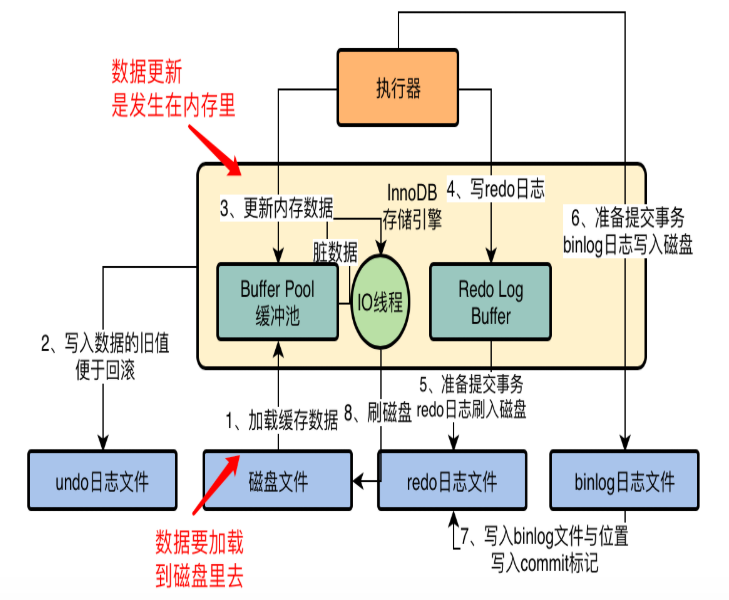
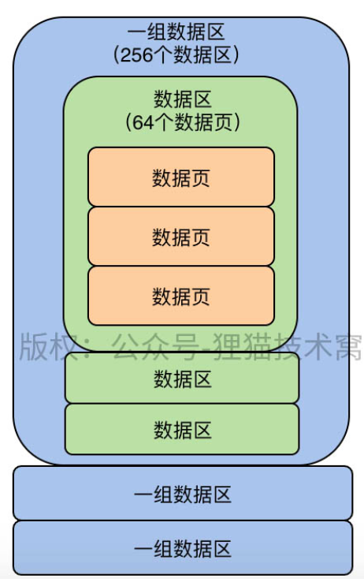

# MySQL

[TOC]

### 查询过程

> 1、数据库连接池从连接中接受请求
>
> 2、查询解析器解析SQL
>
> 3、查询优化器优化查询路径
>
> 4、执行器调用存储引擎接口检索

### InnoDB日志刷新策略

> innodb_flush_log_at_trx_commmit
>
> 配置0，提交事务，不会把redo log buffer数据写到磁盘redo文件，宕机修改的数据会丢失
>
> 配置1，提交事务，会写到redo文件，宕机可以恢复
>
> 配置2，提交事务，会先写入os cache，然后可能过几秒后才写入redo文件，宕机数据可能丢失


### mysql的binlog日志

> sync_binlog
>
> 配置0，提交事务，先进os cache
>
> 配置1，提交事务，直接写binlog




> binlog日志写完后，会更新redo，同时写一个commit标志
>
> commit标志用来判断此次事务是否彻底结束，如果redo文件中无commit标志，则认为事务执行失败
>
> 
>
> mysql有个后台线程，随机把bufferpool的数据同步到磁盘

### 数据库压测

> sysbentch工具

#### 几个性能指标

> QPS：每秒查询数量
>
> TPS：每秒事务提交/回滚数量
>
> IOPS：机器随机IO并发处理能力（太低会导致bufferpool中数据刷回磁盘效率低）
>
> 吞吐量：磁盘存储每秒可以读写多少字节的数据（影响写redo undo等log日志）
>
> latency：往磁盘中写入一条数据的延迟（影响写redo等log）

#### 压测观察

##### CPU、内存情况

> top
>
> load average：平均负载（核数）
>
> 
>
> top - 15:52:00 up 42:35, 1 user, load average: 0.15, 0.05, 0.01
>
> Mem: 33554432k total, 20971520k used, 12268339 free, 307200k buffers

##### 磁盘IO情况

>dstat -d   IO吞吐
>
>dstat -r	IO随机读写（每秒两三百可以承受）

##### 网卡流量

>dstat -n


### Buffer pool

>数据库的一个内存组件，缓存了磁盘的数据，包含了多个缓存页和描述数据


#### free链表

>用来定位空闲的缓存页

#### flush链表

> 脏数据要刷回磁盘的缓存页

#### LRU链表

> 淘汰的缓存页，分为冷热数据两部分（可配比例）

##### 预读机制可能导致问题，如何解决？

>innodb_read_ahead_threshold，如果顺序访问了磁盘区里数据页数量超过这个阈值，就会把下一个相邻区中的所有数据页都加载到缓存
>
>innodb_random_read_ahead，buffer pool中连续的缓存页频繁被访问，也会触发加载到LRU链表
>
>
>
>会导致LRU链表顺序不一定复合，可能频繁被访问的数据会被挤到尾部
>
>通过冷热数据分区解决，数据会先放到冷区头部，innodb_old_blocks_time秒后被访问再移到热区头部


##### 热数据频繁移动也影响性能，如何解决的？

> 热数据区域后3/4部分的缓存页被访问才移动到头部

#### 定时把flush链表和LRU链表尾部落盘

> 后台有线程定时跑，把flush和LRU尾部刷入磁盘，更新free链表

### 设置多个bufferpool，优化并发能力

> 如果给bufferpool分配内存小于1G，则默认只有一个
>
> 如果内存分配比较大，可以设置多个
>
> innodb_buffer_pool_size = 8888888888
>
> innodb_buffer_pool_instances = 4

### chunk机制动态改变pool大小

>每个bufferpool由多个chunk组成，innodb_buffer_pool_chunk_size默认大小128M


### 生产环境设置bufferpool大小

>bufferpool总大小：机器内存的50%-60%
>
>bufferpool总大小 = (chunk大小 * buffpool数量) 的倍数

### 查看bufferpool的命中状态等

>show engine innodb status
>
>
>
>重点参数 hit rate（每千次命中缓存数，越大说明缓存效果越好）、I/O sum（最近50s读取磁盘页数，越大说明越差）

### 物理存储的数据页结构


#### 数据行结构

> 变长字段长度列表（16进制倒序） null值列表（2进制倒序，8bit倍数） 数据头 column01值 column02值

### 表空间

> 1、表空间对应磁盘文件，划分为多组数据区，一组数据区是256个数据区，每个数据区包含64个数据页
>
> 2、第一组数据区内第一个数据区的头三个数据页，都存放特殊信息
>
> 3、其他组数据区内第一个数据区的头两个数据页存放特殊信息



### 调度算法

#### 默认公平调度算法

> 假设发起了多个SQL，第一条简单，第二条复杂，会先执行复杂的耗时长的，第一条则等待

#### deadline算法

> 任何一个IO操作都不能一直不停的等待，在指定时间范围内要让其执行

### redo log

>redo log 先进到内存redo log buffer（innodb_log_buffer_size，默认16M），写redo block，然后再写入磁盘
>
>
>
>1、如果redo log buffer已经消耗容量的一半，立刻把buffer缓存写磁盘
>
>2、事务提交，写磁盘
>
>3、后台线程定时，每隔1秒写一次
>
>4、mysql关闭时，写磁盘
>
>5、redo log磁盘文件写满了，马上要重新复写，也会触发


### undo log

##### 多版本链条 + ReadView机制（MVCC实现原理）

>1、每条数据都有两个隐藏字段，trx_id（最近一次更新的事务id）、roll_pointer（指向事务之前的undo log）
>
>2、每个事务都生成一个ReadView，包含m_ids（哪些事务还未提交）、min_trx_id（m_ids里最小值）、max_trx_id（下一个要生成的事务id）、creator_trx_id（当前事务id）
>
>
>
>当前事务id 60 比数据条B内trx_id 70小，在min_trx_id和max_trx_id之间，且m_ids内包含70说明未提交，因此本条不可读，继续顺着版本链查下一条
>
>当前事务id 60 比数据条C内trx_id 80小，且max_trx_id 71 比80小，说明本条是在事务发生之后提交的，因此不可查（解决了幻读）


#### 数据抖动

##### 可能性1：RAID架构锂电池

> RAID存储架构：管理多磁盘阵列
>
> RAID 0、RAID 1、RAID 0+1、RAID 2等（记不记得那个图）
>
> RAID卡缓存：在服务器断电时，由锂电池供电支持缓存数据写到磁盘，锂电池需要定期充放电保证寿命，如果使用了RAID存储技术，那么在电池放电期间，RAID写入会不经过缓存，就可能会出现抖动，导致性能下降

###### 解决方案

> 1、更换为电容
>
> 2、通过脚本充放电，在凌晨执行
>
> 3、充放电时不要把缓存级别从write back改为write through
>
> 一般2和3配合使用

##### 可能性2：buffer pool内存页都满了，脏页数据要写入磁盘

##### 可能性3：磁盘redo log所有文件都写满了，要回到第一个文件重新复写，此时缓存redo buffer内数据要写磁盘

###### 解决方案

>1、换SSD固态硬盘
>
>2、fio测试磁盘最大随机IO速率，修改配置innodb_io_capacity参数，让数据库用最大速率flush缓存页到磁盘
>
>3、innodb_flush_neighbors，flush缓存页到磁盘时，可能会把临近的n页也刷到磁盘，可以设置为0（不是重点，附加的）

### 页分裂

>如果主键不是自增的，需保证后加的数据页内主键值一定大于前一数据页内的主键，如果不是则数据行进行移动


### 聚簇索引（主键索引）

> 基于主键的索引结构，由索引页+数据页组成的B+ Tree，叶子节点存放的就是数据页


#### 对主键外其他字段建立索引（二级索引）

> 建立另一颗B+Tree索引（A），叶子节点的数据页内，仅存放主键和字段（组合索引放多个字段），按字段大小排列

###### 查询过程

> 1、在索引A中根据目标字段查找，取出对应主键
>
> 2、回表查询，根据主键值，在主键索引中查出具体完整数据

### 联合索引的几个原则

> 假设联合索引（class_name,student_name,subject_name），必须先按class_name查，再按student_name查，最后再查subject_name，不能跳过前两个直接查最后一个
>
> （索引中等值匹配字段放最左，范围匹配字段放最右）

#### 1、等值匹配

>where条件字段名与联合索引一致，且都是等号匹配（顺序不一致也没事，优化器会改为和索引一致）

```sql
where class_name = "" and subject_name = "" and student_name = ""
```

#### 2、最左侧列匹配

> 从左侧向右可以用

```sql
where class_name = "" 可以在索引里搜索class_name
where class_name = "" and subject_name = "" 可以在索引里搜索class_name，但是subject_name不行
```

#### 3、最左前缀匹配

>可以在索引中查class_name

```sql
where class_name like "1%"
```

#### 4、范围查找

```sql
where class_name > 1班 and class_name < 5班 可以在索引里，找到1班数据页、5班数据页，中间范围即为结果
where class_name > 1班 and class_name < 5班 and student_name > "" student_name无法范围查询
```

#### 5、等值匹配+范围匹配

```sql
where class_name = 1班 and student_name > "" and student_name < "" 可以在索引里按class_name找到一批数据，这批数据的student_name都是有序的，所以student_name >可以用到索引，但是<用不到
```


#### order by、group by

> 如果字段顺序跟复合索引中最左侧开始的字段顺序一样，可以用到索引
>
> where sex=0 order by score 这种也能用到（因为sex为0的数据都是在一起）

### 覆盖索引

>查询目标值跟联合索引中的值一样，不需要回表去主键索引扫描其他字段

```sql
select a1,a2,a3 from table order by a1,a2,a3
```

### 执行计划里的数据访问方式

> 1、const  通过聚簇索引或二级索引（唯一索引）+回查
>
> 2、ref  通过普通二级索引
>
> 3、ref_or_null  查询条件使用is null
>
> 4、index  遍历了二级索引，直接就取到了目标值
>
> 5、range
>
> 6、all 全表扫描