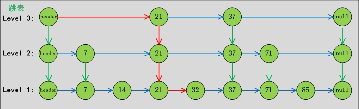

# java

[TOC]

### 符号

二进制 

> 0b

八进制 

> 0开头

十六进制

> 0x开头

##### &、 |、 ~、 ^、<<、>>

>&：两个数都转为二进制，然后从高位开始比较，如果两个数都为1则为1，否则为0
>
>| ：两个数都转为二进制，然后从高位开始比较，两个数只要有一个为1则为1，否则就为0
>
>~：如果位为0，结果是1，如果位为1，结果是0
>
>^：两个数转为二进制，然后从高位开始比较，如果相同则为0，不相同则为1

### 类加载，双亲委派原则

类加载过程：

加载 - 读取文件堆中生成class对象

验证 - 验证文件格式、符号引用等完整性

准备 - 分配内存

解析 - 常量池转化引用

方法初始化 

使用

加载器：

g


|      |      |      |      |
| ---- | ---- | ---- | ---- |
|      |      |      |      |
|      |      |      |      |
|      |      |      |      |

双亲委派原则：

类首先交给父类加载器加载，父类无法完成再由子类加载

为了保证最后得到的都是同一个对象

### 泛型

>参数化类型，不指定具体类型，传入一个参数代替

### @FunctionalInterface

> 函数式接口（该注解不是必须的），只能标记在有且只有一个静态方法上

```java
// 正确的函数式接口
@FunctionalInterface
public interface TestInterface {

    // 抽象方法
    public void sub();

    // java.lang.Object中的方法不是抽象方法
    public boolean equals(Object var1);

    // default不是抽象方法
    public default void defaultMethod(){

    }

    // static不是抽象方法
    public static void staticMethod(){

    }
}
```

### 对象初始化顺序

> 静态代码块 构造语句块 构造函数

### 抽象类和接口

> sdf

### 序列化

> 父类未实现序列化，想要变量可序列化需要在子类中扩充实现
>
> static关键字修饰不会被序列化（反序列化出的值非原值，为内存中当前值）
>
> 如果只想部分序列化：
>
> - transient修饰
> - 增加writeObject、readObject<u>**私有**</u>方法
> - 使用Externalizable实现
>
> | 方式                   | 过程                                | 特征                                  |
> | ---------------------- | ----------------------------------- | ------------------------------------- |
> | 实现Serializable接口   | 自动序列化                          | transient关键字修饰的变量不会被序列化 |
> | 实现Externalizable接口 | 重写writeExternal、readExternal方法 |                                       |
>

### skipList

>1、分为多层，节点有序
>
>2、可以用类二分法查找，加快速度

[](https://images0.cnblogs.com/blog/497634/201312/30222128-045c88b7e992443395a540ba2eb740f3.jpg)

## 多线程

### 进程

使用Runtime

```java
Runtime runtime = Runtime.getRuntime();
runtime.exec("notepad");
```

使用ProcessBuilder

```java
ProcessBuilder builder = new ProcessBuilder("notepad");
builder.start();
```

### 线程

#### 继承Thread

```java
public class MyThread extends Thread {
    public void run(){
         // ...
    }
}

MyThread myThread = new MyThread();
myThread.start();
```

#### 实现Runnable接口

```java
class MyRunnable implements Runnable{
    public void run(){
        // ...
    };
}
Thread thread = new Thread(new MyRunnable());
thread.start();
```

#### 匿名内部类

```java
new Thread(new Runnable(){
    @Override
	public void run(){
         // ...
    }
}).start();
```

```java
new Thread() {
    @Override
	public void run() {
	 	// ...
	}
}.start();
```
#### lambda表达式

```java
new Thread(()->{
     // ...
    
}).start();
```

### Thread调用start()和run()有什么区别？

>run()不启动新线程

### Thread调用sleep()、wait()和yield()有什么区别？

>sleep线程休眠，让出CPU，但是不会释放锁资源
>
>wait释放CPU和锁
>
>yeild释放CPU的执行权，只要优先级大于等于当前线程的，都有可能再次获得（自己也可能再次获得）


### volatile关键字

> volatile关键字修饰的变量，所有线程都可见，保证每次拿到的都是最新的值，引用类型如数组对象，引用是一致的，但是值不保证

> 线程都有独立的工作内存，volatile修饰的成员变量值存放在主内存，每个线程取用时都会取最新值到自己的工作内存，处理完成后再同步到主内存

### 线程运行时发生异常会怎么样？

> 停止执行，被捕获抛出异常，未被捕获JVM会对中断线程进行getUncaughtExceptionHandler()来获取异常并处理

### 死锁与活锁的区别

> 死锁：状态不变，无法执行
>
> 活锁：状态在变，但是也无法执行

### 如何避免死锁

> 死锁产生的条件：
>
> 互斥条件：一个资源每次只能被一个线程使用
>
> 请求并持有条件：请求其他资源阻塞时，对已持有的资源保持不放
>
> 不可剥夺条件：未结束前不可被强行剥夺已持有资源
>
> 循环等待条件：多个线程间存在首尾循环等待关系
>
> 
>
> 阻止发生循环等待条件，线程有序的获取竞态资源

### HashMap、HashTable、ConcurrentHashMap区别

>HashMap数据结构什么样？
>
>数组+链表存储，计算key的hash值，按数组大小取余存放;
>
>如果key计算出的hash值相同(hash碰撞)，则放在同链表下一个节点，取值时遍历key名equals()取值
>
>如果链表超长（长度8转成tree，6转回链表-看下红黑树的时间复杂度Ologn），会改造成树形存储
>
>
>
>HashTable、concurrentHashMap线程安全
>
>HashTable加synchronized锁住整个hash表
>
>concurrentHashMap将hash表拆分，默认拆分为16个，增加了lock（读不加锁，Node中value变量是volatile的，Node用volatile修饰是为了并发下扩容安全），只锁住一个数组槽，性能更好


>
>
>HashMap key和value可以为null（key在hash时做了判断，为null返回0）
>
>HashTable、concurrentHashMap的key/value不可以为null，加了判断会报NullPointerException异常


|                       | 说明                                             | 存储方式 | 并发安全实现方式        | 备注                                                         |
| --------------------- | ------------------------------------------------ | -------- | ----------------------- | ------------------------------------------------------------ |
| ConcurrentHashMap     |                                                  | HashMap  | volatile + cas          |                                                              |
| ConcurrentSkipListMap | 可以提供有序的出队                               | SkipList | volatile + cas          | 接口ConcurrentNavigableMap -> NavigableMap -> comparator排序 |
| ConcurrentSkipListSet |                                                  |          | ConcurrentSkipListMap   | 接口NavigableSet->SortedSet -> 有序                          |
| CopyOnWriteArrayList  | 在写的时候复制一个副本，修改完变更指针指向新副本 | 数组     | ReentrantLock锁住写方法 | 读不保证最新，只保证最终一致性，适合读多写少                 |
| CopyOnWriteArraySet   |                                                  |          | CopyOnWriteArrayList    |                                                              |

TreeMap红黑树存储，在非多线程的情况下，使用TreeMap。

低并发可以使用Collections.synchronizedSortedMap将TreeMap进行包装

高并发应当使用ConcurrentSkipListMap，能够提供更高的并发度。
在多线程程序中，如果需要对Map的键值进行排序，请尽量使用ConcurrentSkipListMap

### ThreadLocal、InheritableThreadLocal、ThreadLocalRandom

>ThreadLocal创建线程本地变量
>
>实现方式：为当前线程中treadLocals（ThreadLocalMap类型）对象赋值
>
>map的key：ThreadLocal对象
>
>map的value：Entry对象数组
>
>set方法，ThreadLocal的hash值和Entry数组长度-1，逻辑与计算出数组下标i
>
>get方法，ThreadLocal的hash值和Entry数组长度-1，逻辑与计算出数组下标i，查询如果key相同返回value，如不同或为null，i+1继续查询
>
>
>
>InheritableThreadLocal是ThreadLoca的子类，复写了getMap和createMap方法，返回线程中的inheritableThreadLocals对象，支持继承可以让子线程访问到父线程设置的本地变量
>
>实现方式：创建子线程时，会查看当前线程inheritableThreadLocals是否为空，如果不为空则复制给新线程的inheritableThreadLocals对象
>
>如果不想要继承？可以通过Thread的构造函数（传false）控制是否要继承inheritableThreadLocals
>
>
>
>为什么要用ThreadLocalRandom？
>
>首先Random的随机种子，多线程可能获取到相同的，为了防止出现重复，随机种子使用Atomic原子对象，CAS机制保证种子的不同，会出现并发的性能问题。

### LockSupport、AQS

>LockSupport用来挂起取回线程，锁实现的工具类，锁要实现AQS接口
>
>AQS内部是Node形式的双向链表，获取到锁可以建多个condition，condition也是Node形式链表，存放被挂起的线程

### 并发锁

**读读共享、写写互斥、读写互斥、写读互斥**

| 锁                    |                                                             |                                                              |                                                              |
| --------------------- | ----------------------------------------------------------- | ------------------------------------------------------------ | ------------------------------------------------------------ |
| ReetrantLock          | ReetrantLock(true/false)公平/非公平锁，默认非公平锁、独占锁 |                                                              |                                                              |
| ReetrantReadWriteLock | 可重入                                                      | WriteLock-独占锁，某时只允许一个线程获取到，如果已有线程获取到**读锁或写锁**，则阻塞；ReadLock-如果已有线程获取到**写锁**则阻塞，读锁不管重入 | 如果再用两个变量去判定锁状态，那么又如何保证变量自身的可靠性呢？ReentrantReadWriteLock 是通过一个状态变量来控制的，具体为 高16位保存读锁状态，低16位保存写锁状态读锁的获取；写锁没被占用时，即低位为0时，高位大于0即可代表获取了读锁，所以，读锁是n个可用的。而写锁的获取，则要依赖高低位判定了，高位大于0，即代表还有读锁存在，不能进入，如果高位为0，也不一定可进入，低位不为0则代表有写锁在占用，所以只有高低位都为0时，写锁才可用 |
| StampedLock           | 不可重入，和ReadWriteLock区别在于读的时候也允许写锁后写入   | 三个方法：writeLock()-同上、readLock()-共享锁悲观读锁、tryOptimisticRead()-乐观读锁，通过验证版本（stamp），如果不一致则再调用readLock，tryConvertToWriteLock(long stamp)等方法锁类型可以互转 |                                                              |

### 并发队列

| 队列                      | 特征                                                         | 结构                                           | 场景         |
| ------------------------- | ------------------------------------------------------------ | ---------------------------------------------- | ------------ |
| ConcurrentLinkedQueue     | CAS非阻塞                                                    | Node链表                                       |              |
| ConcurrentLinked**Dueue** | 双向（同时支持FIFO和FILO），和ConcurrentLinkedQueue实现一样，只是为双端操作定义了几个可供操作的节点类型 | Node链表                                       | 多生产多消费 |
| LinkedBlockingQueue       | 独占锁阻塞                                                   | Node链表（默认Integer.MAX_VALUE）              |              |
| ArrayBlockingQueue        | 独占锁阻塞                                                   | 有界数组（需初始化大小）、二叉树维护元素优先级 |              |
| PriorityBlockingQueue     | 独占锁阻塞、带优先级（compare比较）                          | 无界数组                                       |              |
| DelayQueue                | 阻塞延迟队列，过期元素才出队                                 | 队列头是快过期的元素                           |              |
| SynchronousQueue          | 不存储，每一个take的线程会**阻塞直到有一个put的线程放入元素**，反之亦然 |                                                |              |
| LinkedBlocking**Deque**   |                                                              |                                                |              |
| LinkedTransferQueue       | 阻塞，预占模式，取元素时如果队列为空，新建一个null节点等待入队，当元素入队时发现null节点，直接唤醒消费者线程取走 | 链表                                           |              |

### 同步器

主线程等待子线程都执行完毕再执行

通过Thread.join()控制子线程顺序，缺点：1使用线程池时无法调用到 2需要等待子线程彻底执行完毕

CountDownLatch可以在任意位置countDown，不需要等待子线程彻底执行完

|                |          |                                 |                                                              |                             |
| -------------- | -------- | ------------------------------- | :----------------------------------------------------------- | --------------------------- |
| CountDownLatch | 计数器   | 基于AQS实现，count赋值给了state | 值递减，count变为0时，多个线程同时达到截断点await()才继续向下进行 |                             |
| CyclicBarrier  | 回环屏障 | ReentrantLock（锁是基于AQS）    | 同上，可复用                                                 | parties赋值给cout，实现复用 |
| Semaphore      | 信号量   | 基于AQS，公平和非公平策略       | 值递增，acquire(n)，当count增长到n时向下进行                 | 重新调用acquire复用         |

### happen-before

>先行发生原则（Happens-Before）是判断数据是否存在竞争、线程是否安全的主要依据。
>
>先行发生是Java内存，模型中定义的两项操作之间的偏序关系，如果操作A先行发生于操作B，那么操作A产生的影响能够被操作B观察到。

## 线程池

### 参数

|                 | 说明                |                                      |
| --------------- | ------------------- | ------------------------------------ |
| corePoolSize    | 核心线程数          | 核心线程数量                         |
| maximumPoolSize | 最大线程数          | 支持最大的线程数                     |
| keepAliveTime   | 非核心线程超时时长  | 非核心线程在空闲时被系统回收         |
| unit            | keepAliveTime的单位 | 纳秒、微秒、毫秒、秒、分、时、天等   |
| workQueue       | 任务队列            | 队列里存放要执行的任务               |
| threadFactory   | 线程工厂            | 创建新线程                           |
| handler         | 拒绝策略            | 默认抛RejectedExecutionException异常 |

任务来时，当前线程池中的线程数（size）：

1、size < corePoolSize时，启动一个核心线程执行

2、size >= corePoolSize，workQueue未满时，添加到队列等待执行

3、size >= corePoolSize，workQueue已满，size < maximumPoolSize时，启动一个非核心线程执行

4、size >= corePoolSize，workQueue已满，size > maximumPoolSize时，调用handler

### 常用的线程池

```
new ThreadPoolExecutor()对象来创建
```

| 创建方法                | 线程池对象                                            | 使用队列            | 说明                                                         |
| ----------------------- | ----------------------------------------------------- | ------------------- | ------------------------------------------------------------ |
| newFixedThreadPool      | corePoolSize = maximumPoolSize = n                    | LinkedBlockingQueue | 固定线程数量                                                 |
| newSingleThreadExecutor | corePoolSize =  maximumPoolSize = 1                   | LinkedBlockingQueue | 只有一个线程                                                 |
| newCachedThreadPool     | corePoolSize = 0, maximumPoolSize = Integer.MAX_VALUE | SynchronousQueue    | SynchronousQueue装等待的任务，这个阻塞队列没有存储空间，这意味着只要有请求到来，就必须要找到一条工作线程处理他，如果当前没有空闲的线程，那么就会再创建一条新的线程 |
| newScheduledThreadPool  | corePoolSize = n, maximumPoolSize = Integer.MAX_VALUE | DelayedWorkQueue    | 延迟执行                                                     |

#### 为什么使用ThreadPoolExcutor不是用Excutor直接创建线程池？

Excutor里的创建方法固定参数比如maximumPoolSize=Integer.MAX_VALUE、LinkedBlockingQueue，在某写情况下（比如写大于读），线程无限增加，队列无限增大，造成内存溢出（OOM）

#### 线程池方法submit(Callable)和excute(Runnable)的区别

>Callable接口有返回值，抛出异常
>
>```
>@FunctionalInterface
>public interface Callable<V> {
>/**
>    * Computes a result, or throws an exception if unable to do so.
>    *
>    * @return computed result
>    * @throws Exception if unable to compute a result
>    */
>   V call() throws Exception;
>}
>```
>
>Runnable
>
>```
>@FunctionalInterface
>public interface Runnable {
>   /**
>    * When an object implementing interface <code>Runnable</code> is used
>    * to create a thread, starting the thread causes the object's
>    * <code>run</code> method to be called in that separately executing
>    * thread.
>    * <p>
>    * The general contract of the method <code>run</code> is that it may
>    * take any action whatsoever.
>    *
>    * @see     java.lang.Thread#run()
>    */
>   public abstract void run();
>}
>```


